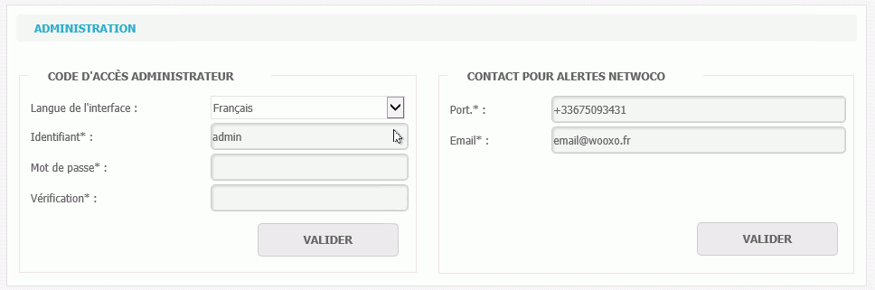

# Changement des identifiants d'administration

 Le changement des identifiants s'effectue dans la partie Administration.

1. Choisissez dans la liste déroulante la langue dans laquelle vous voulez afficher l'interface.
2. Saisissez votre nouvel identifiant \(login\).
3. Saisissez votre nouveau mot de passe et re validez le dans le champ Vérification.
4. Cliquez sur Valider.


A la prochaine connexion vous devrez maintenant saisir vos nouveaux identifiants.


Un numéro de portable et une adresse e-mail doivent être saisis pour permettre l'envoi d' alertes en cas de problème technique.

