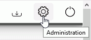

# Changing Administrator Credentials

The administrator credentials change is done in the Administration.

1. Select in the drop down list the language in which you want to display the interface.
2. Enter your new ID \(login\).
3. Enter your new password and validate it again in the Verification field.
4. Click "Validate".


At the next connection you now will be asked to enter your new credential. 


A mobile phone and an e-mail address must be entered in order to send alerts in case of technical problem.

