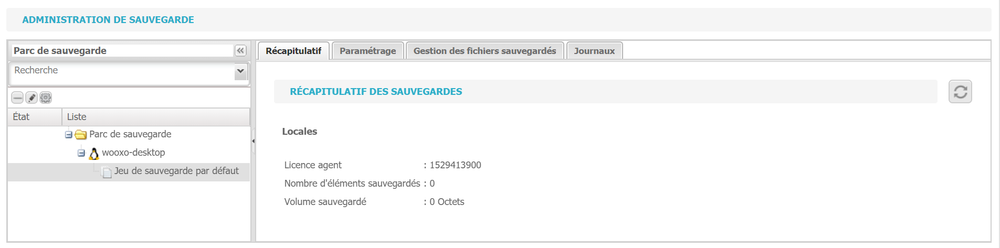
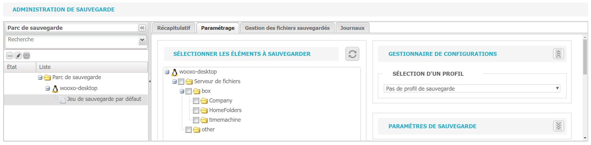
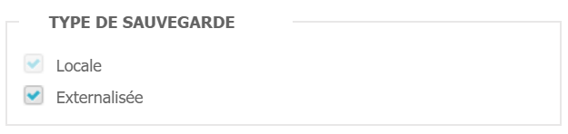

# Configuration de la réplication box to box

La configuration de la réplication s'effectue dans l'onglet "Sauvegarde".

.gif>)

1\. Sélectionnez le jeu de sauvegarde concerné.

2\. Cliquez sur l'onglet "Paramétrage", puis sélectionnez "Paramètres de sauvegarde".

3\. Cochez la case "Externalisée".

