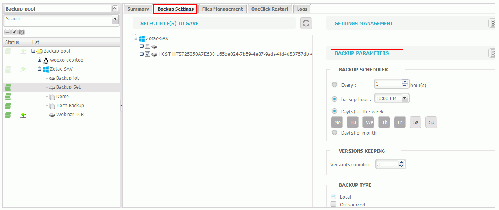

# Configuration of the Box to Box Replication

The configuration of the replication is done in the "Backup" tab.

1. Select the appropriate backup set.

2. Click the "Backup Settings" tab, and then select "Backup Parameters".

3. Check the box "Externalized".

