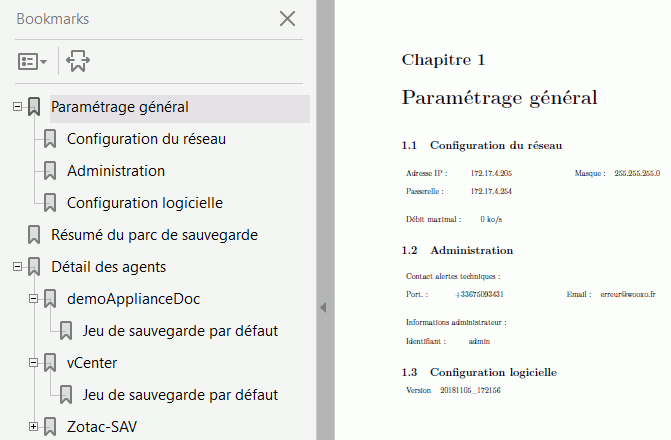

# Informations techniques

Les informations techniques se trouvent dans la partie Administration.

Cette partie 

* fournit le numéro de licence, 
* indique les numéros de versions des différents composants et 
* permet la génération et signature du rapport de configuration.

Le rapport  de configuration est utilisé pour résumer et garder une trace du paramétrage effectué. L'objectif est de le générer et de l'imprimer afin le faire valider par une signature manuelle ou électronique à l'aide du bouton correspondant.

Le rapport de gestion résume tout le paramétrage effectué :

* Paramétrage général 
  * Configuration du réseau
  * Administration générale : identifiant et contact de l'administrateur
  * Configuration logicielle : version
* Résumé du parc de sauvegarde \(liste des machines composant le parc\)
* Détails des agents 
  * Informations relatives à la machine \(nom, adresse IP,  système d’exploitation\)
  * Jeu de sauvegarde par défaut
  *  Profil de sauvegarde \(nom du profil,  délais de rétention en jours, emplacement, planning de sauvegarde, filtres\).

