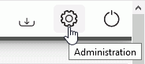
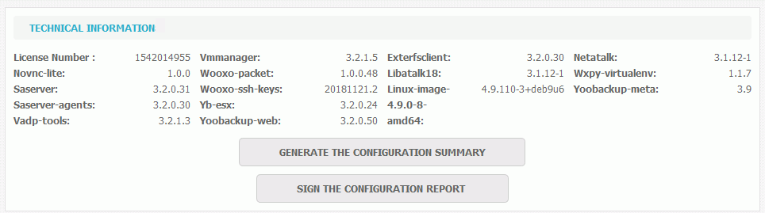
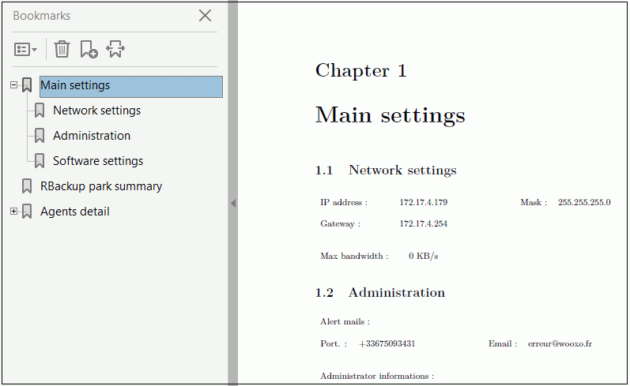

# Technical Information

The access yp the technical information is done in the Administration.

This area:

* Gives license number
* Indicates the version numbers for the various components
* Enables the generation and signature of the configuration report

The configuration report is used to summarize and keep track of the configuration made. The objective is to generate and print it in order to validate it by a manual or electronic signature using the corresponding button.

To create the report under .pdf format, click "Generate the configuration summary".

The report summarizes the configuration made :

* Main Settings 
  * Network Settings
  * Administration: administrator's login and e-mail.
  * Software settings: version
* Backup parl summary \(computer lists\)
* Details of the agents
  * Computer Information \(name, IP Adress,  operating system\)
  * Default backup set
  * Backup profile \(name,  retention period in days, location, backup schedule, filters\).

