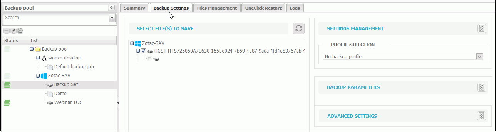
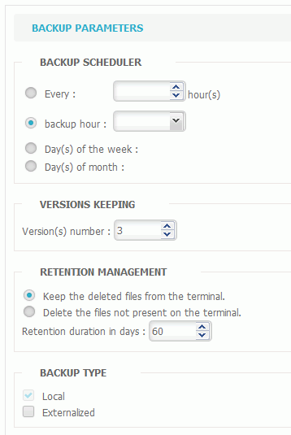
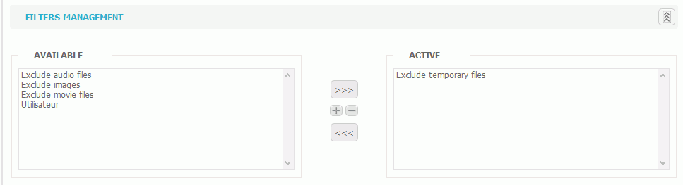

# Backup set Configuration

The configuration of a backup set is done in the "Backup" tab. 

Select in the left panel \(that displays the backup pool\) the backup set you want to configure.

Four tabs give you additional information and enable you to configure the backup set:

* Summary
* Backup Settings
* Files Management
* Logs

### Summary

The summary tab displays the agent's license for which the backup set wil be configured as well as the number of items and volumes backed up. This tab is only for information.

### Backup Settings

It is in the backup setings that the configuration is done.

#### _To configure the items to backup_

1. Select the item\(s\) to backup in the tree. The sub-folders as well as the items added later will automatically be checked. To remove an item from the backup, simply uncheck it.    
2. Select a [Backup Profile](https://docs.yoobackup.fr/~/edit/drafts/-LWjtVvwDwbXk_mJzQSr/v/english/configuration-de-la-sauvegarde/utilisations-des-profils-de-sauvegarde)or enter the settings specific to the backup set being configured.


From this screen you can create a a new profile by choosing the "New Backup Profile" option and setting it directly from the backup set level.


* Backup Scheduler: allows scheduling the launch and frequency of backups at a certain time or/and day of the week or month. 
* Versions Keeping: allows to indicate the number of versions to keep \(e.g., if the last three versions are kept, in case of backup of a new version, the oldest version will be overwritten to be replaced by the last backup\). 
* Retention Management: the retention is the period of time during which information is kept, it can be configured in number of days and its use can be customized. 
* Backup type: the backup can be done on the workstation \(locally\) or locally **and** outsourced.

It is from this tab that you launch the backup by clicking on START BACKUP.

3. Filters Management

Filters configuration allows to exclude or include file categories, folders and directories of the backup.  

Some filters may have been created by default and display in the Available column, use the arrows to add them in the Active column. 

You can also define your own filters by using the lower part of the screen. 

* Enter the filter name
* Click "+"
* Select the filter type: exclude or include \(when backing up\)
* Enter the extension
* Click on the floppy disk \(at te end of the filter name\) to save. The filter displays as available and will need to be added to the active column.

4. Advanced settings

Advanced settings allow writing script\(s\) to run before or after the backup.  For example it can be a pre-backup verification script or a script to shut down a workstation once the backup is finished. 

5. Save the configuration.

### Backed up Files Management

The backed up files management allows to restore files according to the filters configured in this screen.  It is also possible to delete files using the same method. See [File Restores](https://docs.yoobackup.fr/~/edit/drafts/-LWjtVvwDwbXk_mJzQSr/v/english/restauration/restauration-de-fichiers) for more details.

### Logs

This tab opens the activity log. The left part allows filters application \(e.g., period selection, action or view type\). The right part displays the search result.

