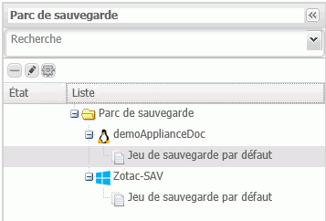
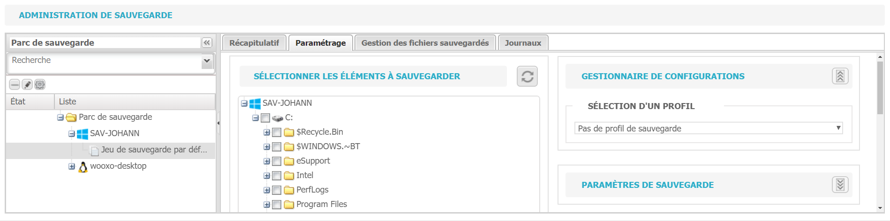
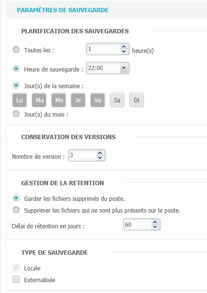
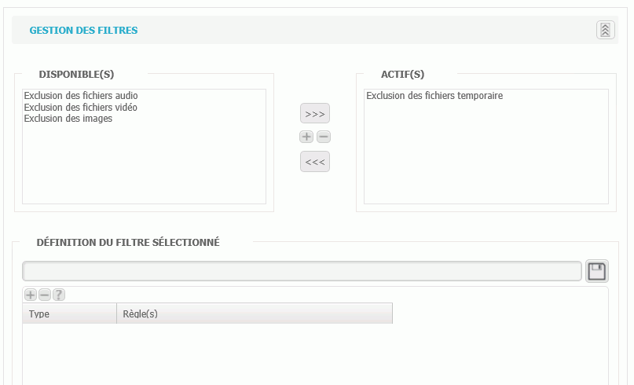

# Configuration d'un jeu de sauvegarde

La configuration d'un jeu de sauvegarde s'effectue dans l'onglet "Sauvegarde".

Sélectionnez dans le panneau de gauche \(affichant le parc de sauvegarde\) le jeu de sauvegarde que vous voulez configurer.

Quatre onglets vont donner des informations complémentaires et vous permettre de configurer votre jeu de sauvegarde :

* Récapitulatif
* Paramétrage
* Gestion des fichiers sauvegardés
* Journaux

### Récapitulatif

L'onglet Récapitulatif affiche la licence de l'agent pour lequel le jeu de sauvegarde va être configuré ainsi que le nombre d'éléments et les volumes sauvegardés. Cet onglet est informatif.

### Paramétrage

C'est dans l'onglet Paramétrage que la configuration de la sauvegarde s'effectue.

#### _Pour paramétrer les éléments à sauvegarder_

1. Sélectionnez le ou les éléments à sauvegarder dans l'arbre.  
   Les sous-dossiers ainsi que les éléments ajoutés par la suite seront automatiquement cochés. Pour supprimer un élément non désiré de la sauvegarde, il suffit de le décocher.

   

2. Sélectionnez un [profil de sauvegarde ](https://docs.wooxo.fr/yb-ug/~/edit/drafts/-LQY2yMQRzvgGj5G0ZCF/configuration-de-la-sauvegarde/utilisations-des-profils-de-sauvegarde)ou saisissez les paramètres propres au jeu de sauvegarde  en cours de paramétrage.


Vous pouvez créer un nouveau profil à partir de cet écran en choisissant l'option Nouveau Profil de sauvegarde et le paramétrer directement au niveau du jeu de sauvegarde.


* Planification des sauvegardes : permet de programmer le lancement et la fréquence des sauvegardes à une certaine heure ou/et un certain jour de la semaine ou du mois.
* Conservation des versions : permet d'indiquer le nombre de versions à conserver \(exemple : si les trois dernières versions sont conservées, en cas de sauvegarde d'une nouvelle version, la version la plus ancienne sera écrasée pour être remplacée par la dernière sauvegarde\).
* Gestion de la rétention : la rétention est le laps de temps pendant lequel les informations sont conservées, celle-ci peut être paramétrée en nombre de jours et son mode peut être personnalisé.
* Type de sauvegarde : la sauvegarde peut se faire sur le poste \(en local\) ou en local **et** externalisée.

3. Paramétrez les filtres

Le paramétrage des filtres permet d'exclure ou d'inclure des catégories de fichiers, dossiers, répertoires de la sauvegarde.

Certains filtres peuvent avoir été créés par défaut et apparaissent dans la colonne Disponible\(s\), il suffit alors d'utiliser les flèches pour les ajouter dans la colonne Actif\(s\). 

Vous pouvez également définir vos propres filtres en utilisant la partie basse de l'écran.

* Saisissez le nom de votre filtre
* Cliquez sur le bouton "+"
* Choisir le type de filtre : exclure ou inclure \(lors de la sauvegarde\)
* Saisir l'extension
* Sauvegarder en cliquant sur la disquette à la fin du nom du filtre. Le filtre apparaîtra comme disponible et devra être ajouter dans la colonne actif\(s\).

4. Configurez les paramètres avancés

Les paramètres avancés vont permettre si besoin d'écrire un ou des scripts à exécuter avant ou après la sauvegarde. Il peut s'agir, par exemple, de script de vérification pré sauvegarde ou un script pour éteindre un poste informatique une fois la sauvegarde effectuée.

5. Sauvegarder le paramétrage.

### Gestion des fichiers sauvegardés

La gestion des fichiers sauvegardés permet de restaurer des fichiers en fonction des filtres configurés dans cet écran. Il est également possible de supprimer des fichiers en utilisant la même méthode. Voir [Restauration de fichiers](https://docs.wooxo.fr/yb-ug/~/edit/drafts/-LQY2yMQRzvgGj5G0ZCF/restauration/restauration-de-fichiers) pour plus de détails.

### Journaux

Cet onglet ouvre le journal d'activité. La partie gauche permet l'application de filtre \(par exemple, la sélection d'une période, le type d'action, ou de vue\). La partie droite affiche le résultat de la recherche.

