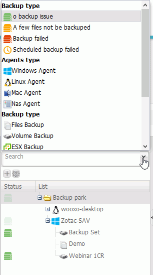
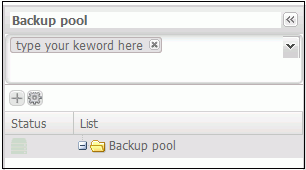
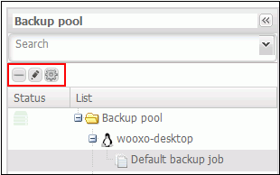
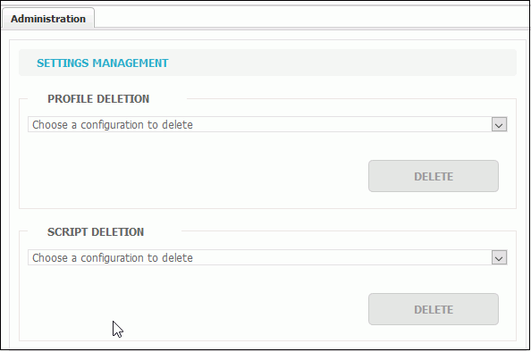
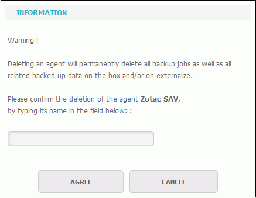

# Agents and Groups Management

The agents and groups managemnet is done in the "Backup" tab.

The agents and backup sets are listed in the left side panel of the interface.

Agents and backup sets displayed can be modified using the existing filters. 

To list and select the filters, click the arrow at the end of the Search field. Perform the same action to select multiple filters. They will display in the Search area. 

If existing filters do not cover your search perimeter, you can search by keywords. 

From this panel it is also possible to:

* Add \("+"\), delete \("-"\) or rename a backup set \(pencil\).

* Manage profiles configuration and scripts from this tab  .

* Directly delete an agent from this side panel by selecting the agent and clicking the "-" button. 


The deletion of agent from the side panel must be used with care, this can cause the destruction of data that are on the backup case. 


