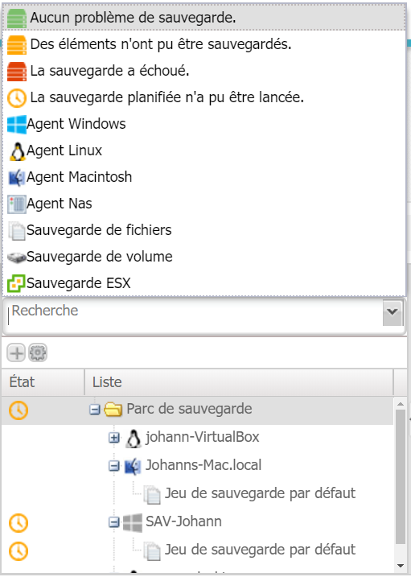
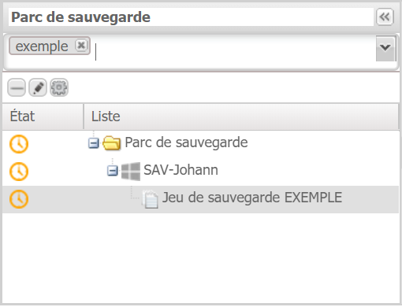

# Gestion des agents et des groupes

La gestion des agents et des groupes s'effectue dans l'onglet "Sauvegarde".

Les différents agents et jeux de sauvegardes sont listés dans le panneau latéral gauche de l'interface.

L'affichage des agents et jeux peut être modifié à l'aide des différents filtres existants.

Pour lister et choisir les filtres, cliquez sur la flèche à la fin du champ Recherche. Reproduisez l'action pour sélectionner plusieurs filtres. Ces derniers s'afficheront dans la zone Recherche.

Si les filtres existants ne couvrent pas votre périmètre de recherche, il est possible d'effectuer une recherche par mots clés.

Depuis ce panneau il est également possible de :

* Ajouter \(bouton "+"\), supprimer \(bouton "-"\) ou renommer un jeu de sauvegarde \(crayon\).

* Gérer la configuration des profils, planificateurs et scripts depuis cet onglet.

* Supprimer directement un agent depuis le panneau latéral en se positionnant sur l'agent et en cliquant sur le bouton "-". 


La suppression d'agent depuis le panneau est à utiliser avec précaution, cela pouvant engendrer la destruction des données présentes sur le boitier de sauvegarde.


