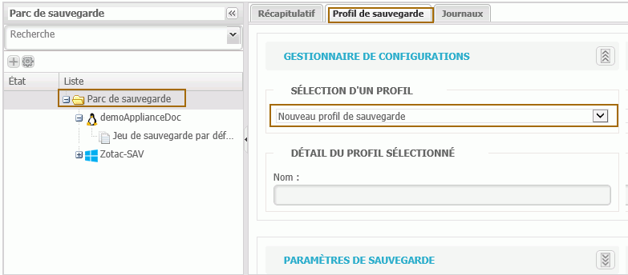
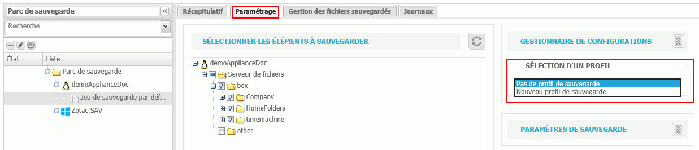

# Utilisations des profils de sauvegarde

Un profil de sauvegarde peut être créé lorsque qu'une même stratégie de sauvegarde est souvent utilisée, ceci afin d'éviter de ressaisir le même paramétrage plusieurs fois. Ces profils sont utiles notamment dans le cas d'une stratégie semblable d'un jeu de sauvegarde à un autre. 

La création d'un profil s'effectue dans l'onglet "Sauvegarde".

#### _Pour créer un nouveau profil de sauvegarde_

1. Positionnez-vous __à la racine du parc de sauvegarde.
2. Sélectionnez l'onglet "Profil de sauvegarde".
3. Choisir Nouveau profil de sauvegarde.
4. Saisir le nom du profil.
5. Définir le paramétrage comme expliqué dans [Configuration d'un jeu de sauvegarde](https://docs.wooxo.fr/yb-ug/~/edit/drafts/-LQY2yMQRzvgGj5G0ZCF/configuration-de-la-sauvegarde/configuration-dun-jeu-de-sauvegarde).
6. Sauvegarder le paramétrage du profil.


Il est également possible de créer un nouveau profil directement à partir d'un jeu de sauvegarde en sélectionnant Nouveau profil de sauvegarde dans la liste déroulante de l'onglet paramétrage \(voir [Configuration d'un jeu de sauvegarde](https://docs.wooxo.fr/yb-ug/~/edit/drafts/-LQY2yMQRzvgGj5G0ZCF/configuration-de-la-sauvegarde/configuration-dun-jeu-de-sauvegarde) pour plus d'informations\).


#### _Appliquer un profil à un jeu de sauvegarde_

1. Sélectionnez le jeu de sauvegarde auquel vous voulez appliquer le profil.
2. Sélectionnez l'onglet Paramétrage.
3. Sélectionnez les éléments à sauvegarder
4. Dans Gestionnaire de configuration, sélectionnez le profil créé.
5. Enregistrer le paramétrage.

​  

