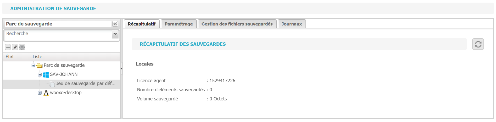

# Utilisations des profils de sauvegarde

Il est possible de créer des profils de sauvegarde, utile notamment dans le cas d'une stratégie différente d'un jeu de sauvegarde à un autre. Pour créer un profil de sauvegarde, il faut se rendre dans l'onglet "Sauvegarde"

Sélectionner un jeu de sauvegarde et aller dans l'onglet "Paramétrage".

Sur le panneau situé à droite de l'écran se trouve le gestionnaire de profils de sauvegarde. Sélectionner "Nouveau profil de sauvegarde" et lui attribuer un nom.

Dans "Paramètres de sauvegarde", plusieurs paramètres sont modifiables:

Planification des sauvegardes: définit à quelle heure et à quelle fréquence les sauvegardes sont effectuées

Conservation des versions: définit le nombre de versions des fichiers à conserver

Gestion de la rétention: définit le mode et la durée de la rétention des fichiers après suppression

Type de sauvegarde: Uniquement locale ou à la fois locale et externalisée

Dans "Gestion des filtres", il est possible de créer des filtres afin d'inclure ou d'exclure différents dossiers, type de fichiers ou autre

Quelques exemples des possibilités offertes par le gestionnaire de filtres:

Enfin, dans "Paramètres avancés", il est possible de créer des scripts pre et post sauvegarde. Par exemple, il est possible de créer un script pour éteindre un poste informatique une fois la sauvegarde effectuée.

  
Il ne faut pas oublier de sauvegarder le paramétrage.

​  

