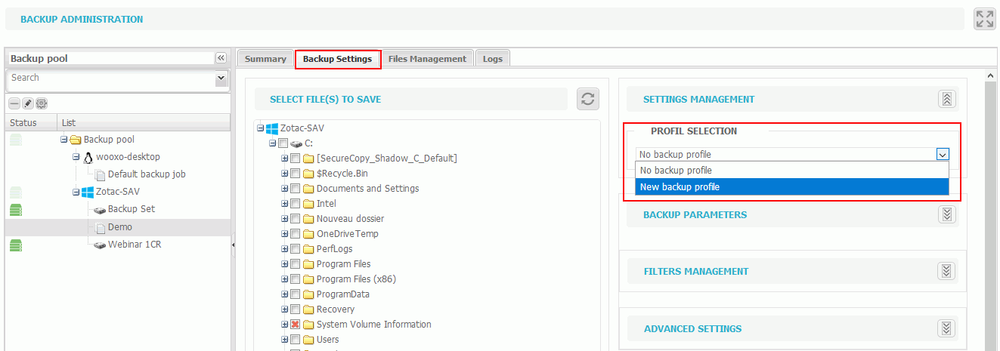

# Use of Backup Profiles

A backup profile can be created when the same backup strategy is often used, in order to avoid re-entering the same configuration multiple times. These profiles are especially used in the cases of similar strategies from one backup set to another.

Profile creation is done in the "Backup" tab.

#### _To create a new backup profile_

1. Select the root of the backup pool.
2. Select the tab "Backup Profiles".
3. Select "New backup profile".
4. Enter the name of the profile.
5. Define the configuration as explained in [Backup set Configuration](https://docs.yoobackup.fr/~/edit/drafts/-LWjtVvwDwbXk_mJzQSr/v/english/configuration-de-la-sauvegarde/configuration-dun-jeu-de-sauvegarde).
6. Save the configuration of the profile.


From the backup set screen you can create a new profile by choosing the "New Backup Profile" in the drop down list of the Settings tab \(see [Backup set Configuration](https://docs.yoobackup.fr/~/edit/drafts/-LWjtVvwDwbXk_mJzQSr/v/english/configuration-de-la-sauvegarde/configuration-dun-jeu-de-sauvegarde) for more information\).


#### _Apply a profile to a backup set_

1. Select the backup set to which you want to apply the profile.
2. Select the Backup Settings tab.
3. Select the items you want to backup.
4. In the settings management tab, the profile created.
5. Save the configuration.

​  

