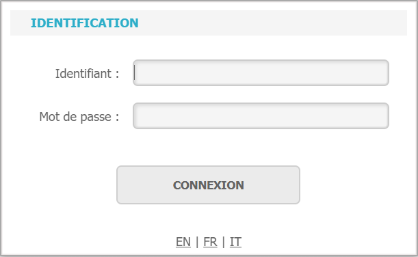

# Installation des agents de sauvegarde

Selon le système d'exploitation utilisé, il va être nécessaire de déployer l'agent adapté.

Pour télécharger l'agent adéquat, il faut dans un premier temps se rendre sur l'interface web Yoobackup et s'identifier.

Il faudra ensuite se rendre dans l'écran "Téléchargement" en cliquant sur .&#x20;

Les différents agents sont disponibles au téléchargement sur cette page.

.PNG>)
