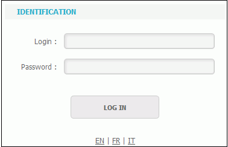
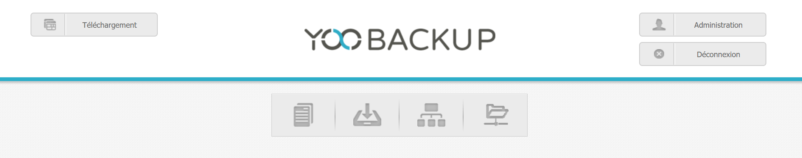
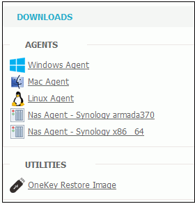

# Backup Agents Installation

Depending on the operating system used, the appropriate agent will have to be deployed.

To download the appropriate agent, you first have to go to the Yoobackup web interface and indentify yourself. 

Then you have to click on the  "Download" icon  .

The agents available for download are displayed on this page.

