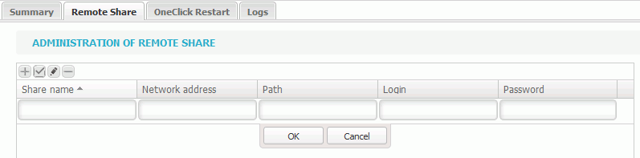

# SAMBA Mounting Connector Configuration

 To perform a SAMBA backup configuration it is not necessary to deploy an agent on the hosts to be backed up.

Upon the activation of the solution, the agent embeed in the appliance is installed, it will have the same hostname as the appliance.

If the agent is not deployed, you can go back to the administration and force its installation.

* Once the agent available, select it:

* Then go to  "Remote share" on the right:

* Click "+" to create a new share

It is necessary to specify a share name to identify it easily, a network adress, the point and ID of the mounting \(do not enter the domain, it will be automatically detected\). 

