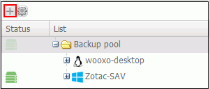
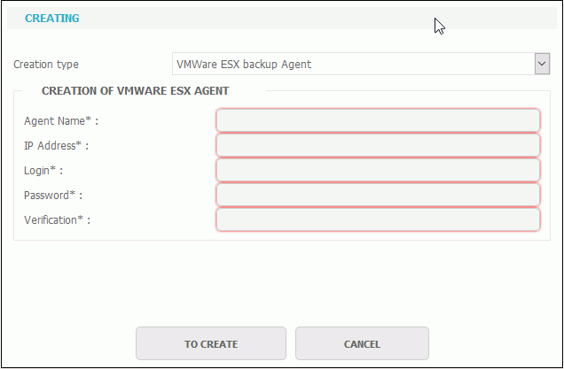

# VMware Connector Configuration

To perform a VMWare backup environment it is not necessary to deploy an agent on the hosts to be backed up.

* Go to the YooBackup interface
* Click on the Backup tab. 
* Select "Backup park"
* Click "+" icon.

* Select "VMware ESX Backup Agent" in the "Creation Type" drop down list. 

* Enter the agent name you want to create and complete the connection information for the ESX host or vCenter.  

Your agent is now available in the YooBackup interface.

