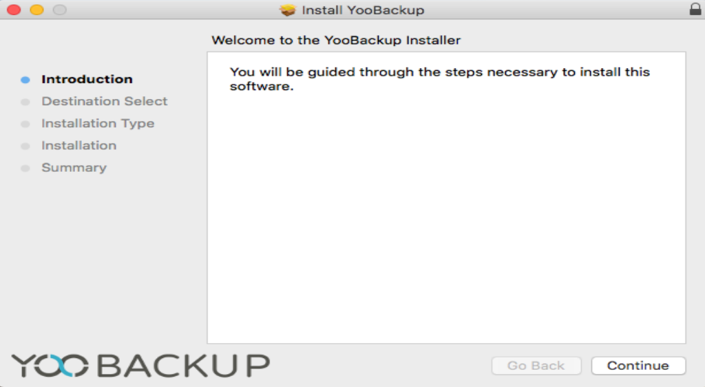
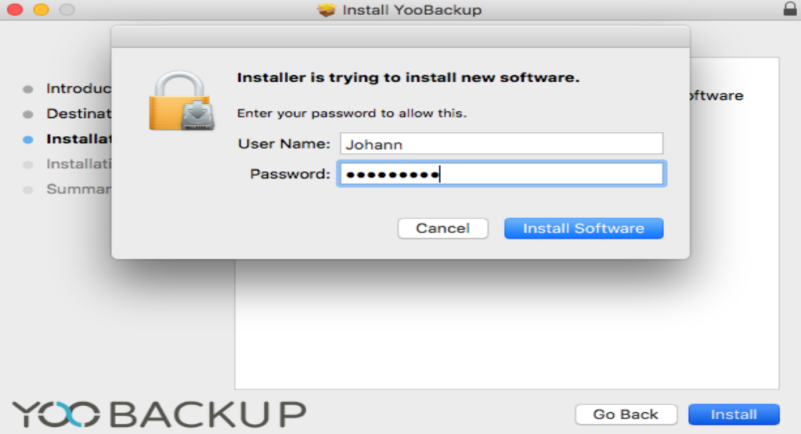
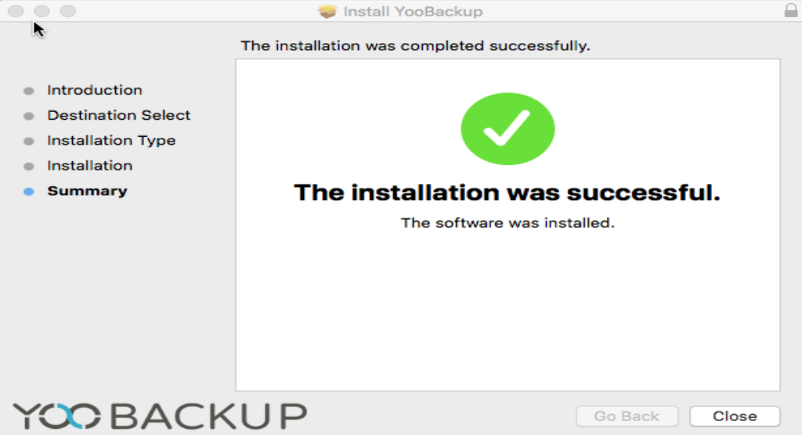

# Installation de l'agent MacOs

\
Une fois l'agent téléchargé depuis l'interface de YooBackup (cf. [Installation des agents de sauvegarde](./)), il vous suffit de suivre les étapes affichées à l'écran et d'indiquer l'adresse IP de l'appliance quand demandé.

Votre agent est à présent disponible dans l'interface YooBackup.
