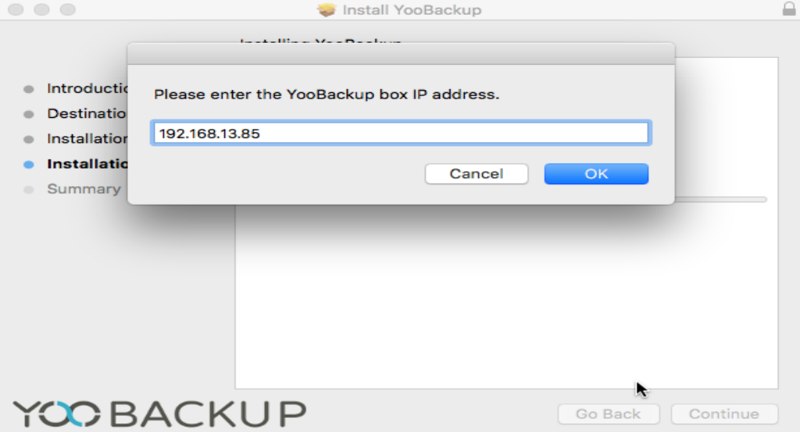

# MacOs Agent Installation

  
Once the agent downloaded from the YooBackup interface \( see [Backup Agents Installation](https://docs.yoobackup.fr/~/edit/drafts/-LWjtVvwDwbXk_mJzQSr/v/english/installation/installation-des-agents-de-sauvegarde)\), you just have to follow the steps displayed and enter the appliance IP address when requested. 

Your agent is now available in the YooBackup interface.

