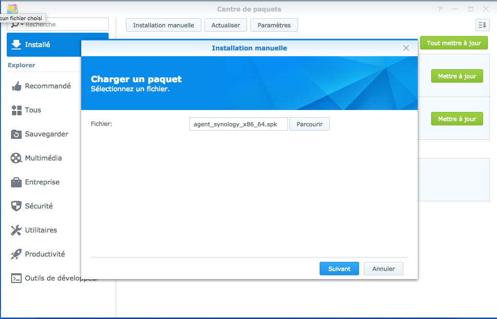

# Synology Agent Installation

First download the corresponding agent to the right architecture from the YooBackup interface \(see. [liste des architectures par modèle](https://www.synology.com/fr-fr/knowledgebase/DSM/tutorial/General/What_kind_of_CPU_does_my_NAS_have)\).

Go to the Synology Web interface to protect, then from the package manager, open the configuration interface to allow the package installation from " Any editor": 

It is now possible to deploy the agent by performing a manual installation.

Load the installation package.

Enter the YooBackup appliance ID when requested. 

You agent is now available on the YooBackup interface.

