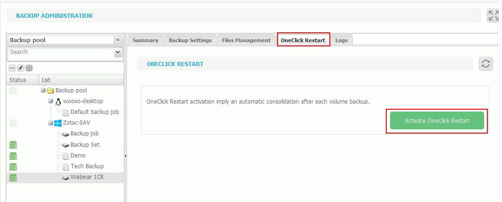

# OneClick Restart Implementation

The OneClick Restart can be done at any time, to do so, go to the YooBackup interface and click on the "Backup" tab.

* In the left panel \(that displays the backup pool\) select the backup set you want to configure
* Click on the OnClick Restart tab
* Click on "Activate OneClick Restart".


In order to work properly, OneClick Restart requires a backup selection with a single virtual machine per job.

Also make sure to select all required disks to ensure that the machine will be able to boot and work properly.



If a backup has already been done, the system triggers a consolidation instantly, otherwise it will wait for the next backup to be completed. 


