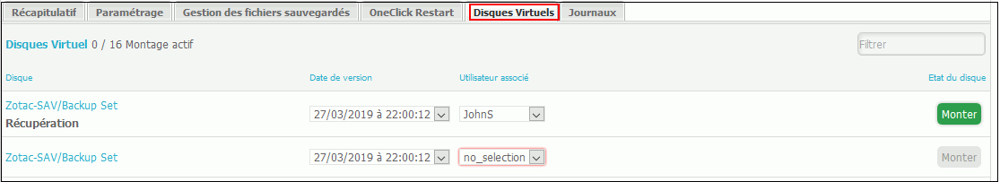

# Restauration granulaire

L'onglet Disques Virtuels, permet d'effectuer une restauration de fichiers en utilisant une image volume, vous avez ainsi la possibilité d'extraire un fichier depuis une image volume.  
Cet onglet est accessible dans la partie "Sauvegarde".

## Effectuer une restauration

Pour accéder au contenu l'utilisateur associé doit se connecter, par le biais de l'explorer, à **ip\_de \_ la\_box\volume\_resto.** Il ****pourra alors accéder au partage réseau et récupérer le contenu de l'image volume.

1. Sélectionnez l'onglet "Disques Virtuels".
2. Sélectionnez une date de version pour laquelle vous voulez effectuer la restauration.
3. Sélectionnez dans la liste déroulante "Utilisateur Associé" l'utilisateur qui pourra se connecter pour récupérer la version choisie. \(Voir [Utilisation serveur de fichiers](../utilisation-serveur-de-fichiers.md#pour-ajouter-un-utilisateur) pour la configuration des utilisateurs\)
4. Cliquez sur "Monter".

## Filesystem compatibles

Vous trouverez ici la compatibilité des filesystem supportés par la restauration granulaire.

| Filesystem | Notes |
| :--- | :--- |
| LVM2 | Les partitions à l'intérieur des groupes LVM2 sont correctement montés. |
| EXT4 |  |
| XFS |  |
| BTRFS | Les sous-volumes ne sont pas supportés. |
| NTFS | Déduplication non supportée. |

