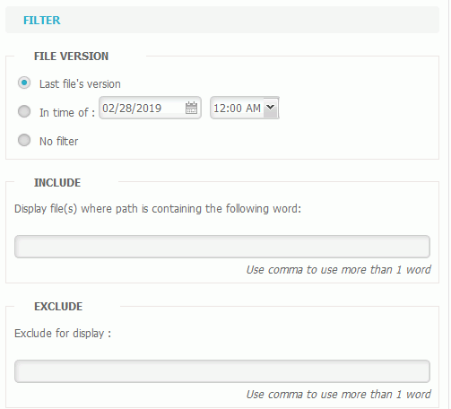

# File Restores

The file restores are done in the "Backup" tab.

1. Select the appropriate backup set.
2. Click on the "Files Management" tab.
3. Select the items to restore.


Display filters are available in the right side panel to easily search for items to restore. It is thus possible to display one or more versions of each item, as well as to exclude items containing certain keywords or having specific extensions.


1. Click "Start to restore" .
2. Select the restore location \(target\). 
3. Validate.


It is possible to restore items to their original location, this action will delete items that are already in this location. 


