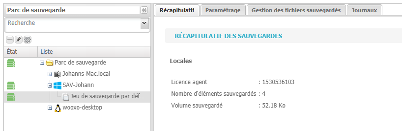
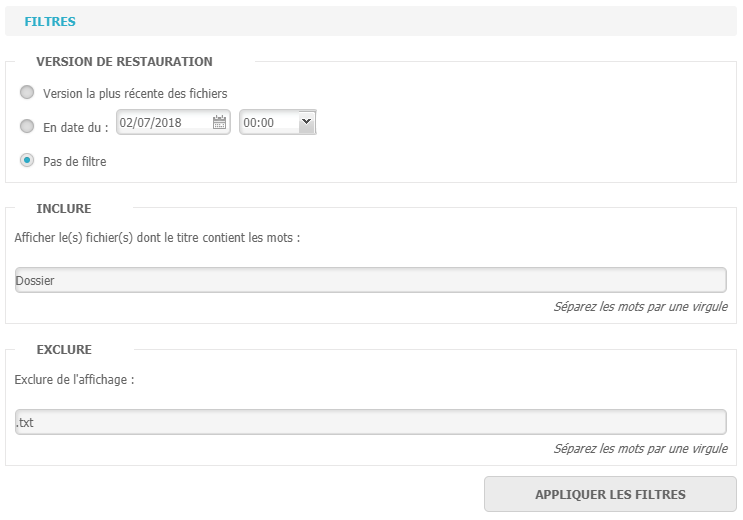

# Restauration de fichiers

 La restauration de fichiers s'effectue dans l'onglet "Sauvegarde".

1. Sélectionnez le jeu de sauvegarde souhaité.
2. Cliquez sur l'onglet "Gestion des fichiers sauvegardés"
3. Sélectionnez les éléments à restaurer.


Des filtres d'affichage sont présents dans le panneau latéral droit afin de simplifier la recherche d'éléments à restaurer. Il est ainsi possible d'afficher une ou plusieurs versions de chaque élément, ainsi que d'afficher ou exclure des éléments contenant certains mots clés ou ayant certaines extensions.


1. Cliquez sur "Lancer la restauration" 
2. Sélectionnez l'emplacement de restauration. 
3. Validez.


Il est possible de restaurer les éléments à leur emplacement d'origine, cette action entraînera la suppression des éléments présents.


