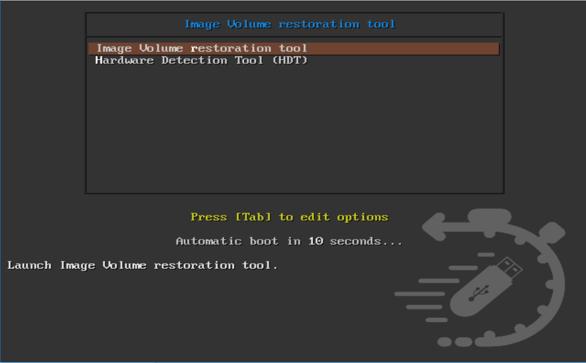
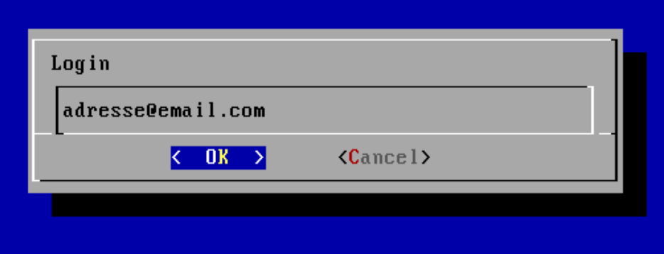
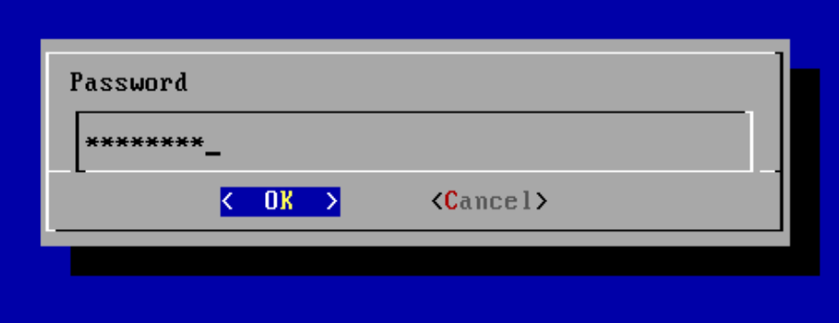

# Restauration OneKeyRestore

Pour restaurer un volume, il suffit de disposer d'un poste informatique ainsi que de la clé usb OneKeyRestore ou son ISO sur n'importe quel support bootable. La procédure pour lancer la restauration d'un volume est très simple.

1. Booter sur la clé OneKey Restore \(ou l'ISO\).

2. Choisir la disposition du clavier.

3. Entrer l'adresse IP du boitier de sauvegarde.

4. Entrer ensuite ses identifiants et mot de passe

