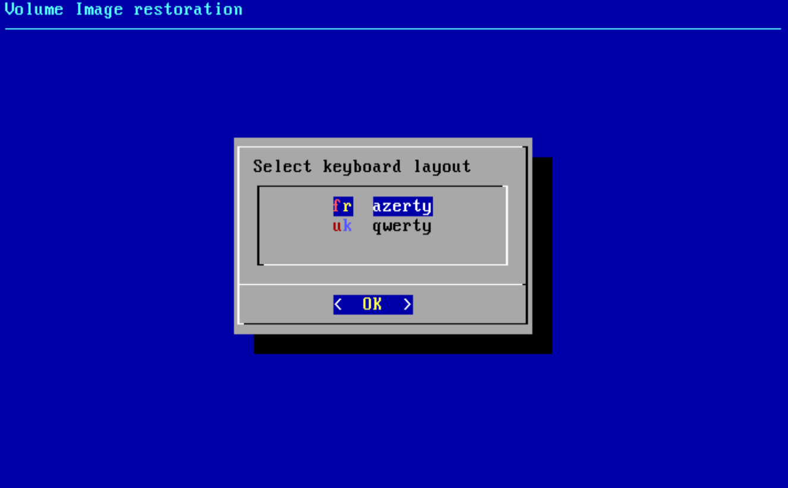
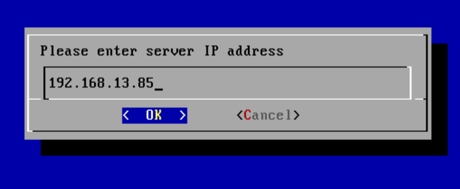

# Restauration OneKeyRestore

Pour restaurer un volume, il faut disposer d'un nouveau poste de travail ainsi que de la clé USB OneKeyRestore fournit avec chaque appliance Yoobackup.

Si vous n'avez pas la clé USB OneKey Restore, vous pouvez télécharger l'image ISO depuis l'interface d'administration de l'appliance YooBackup dans la section Téléchargements. Il est ensuite possible de graver l'image sur un CD ou bien d'utiliser un logiciel comme [Rufus ](https://rufus.ie/fr/)afin de créer une clé USB bootable.


La restauration OneKey Restore peut s'effectuer sur n'importe quelle machine à condition que l'espace disque soit au moins aussi grand que celui de la machine source. \
Attention : Même lorsque la restauration s'effectue sans erreur, elle ne garantie en aucun cas le bon fonctionnement lorsque le matériel est différent de celui de la machine source.


#### _Pour lancer la restauration d'un volume_

1. Booter sur la clé OneKey Restore (ou l'ISO).

2\. Choisir la disposition du clavier.

3\. Entrer l'adresse IP du boitier de sauvegarde.

4\. Entrer ses identifiants et mot de passe

5\. Choisir le poste que l'on souhaite restaurer

6\. Choisir le disque que l'on souhaite restaurer

7\. Choisir la version de chaque partition que l'on souhaite restaurer, par défaut il s'agit de la dernière

8\. Sélectionner la destination&#x20;

9\. Confirmer

La restauration se lance


Si vous souhaitez que la sauvegarde de la machine restaurée se fasse, il vous suffit de réinstaller un agent.


