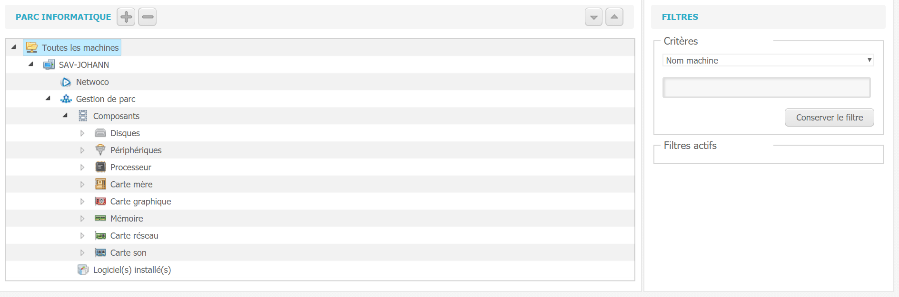
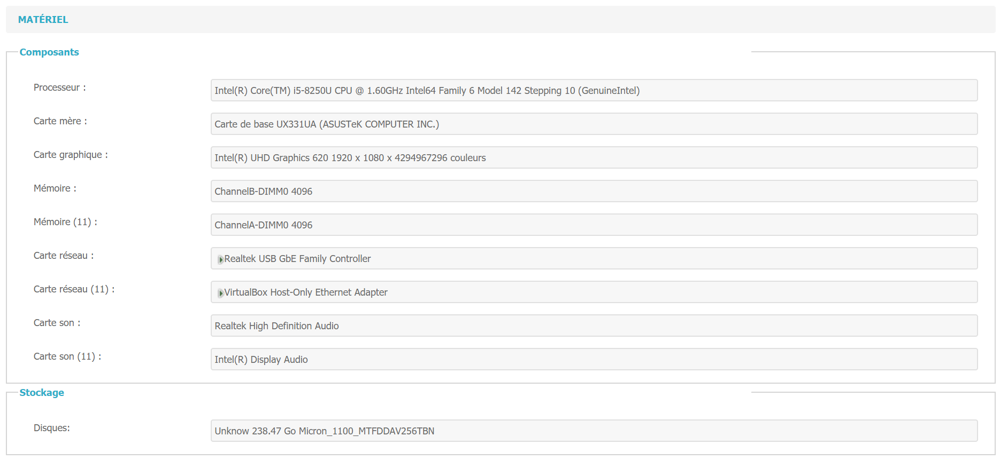
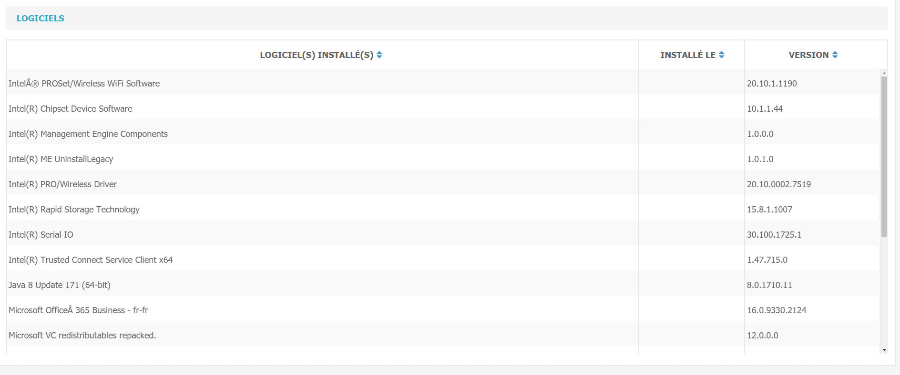
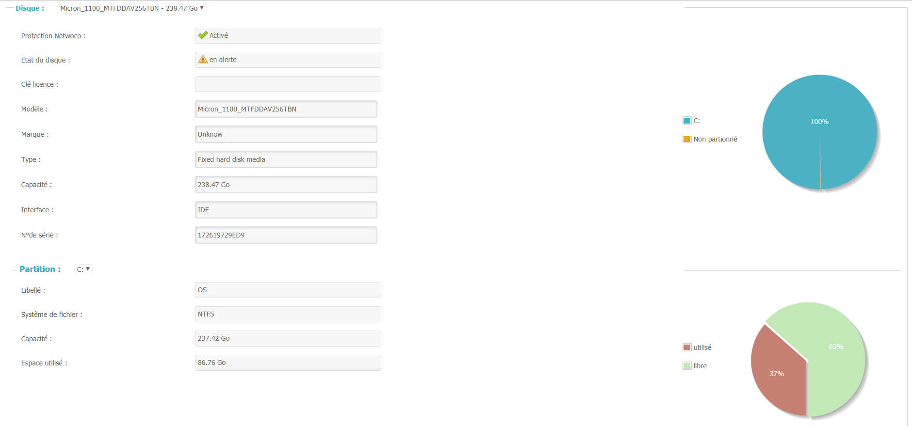
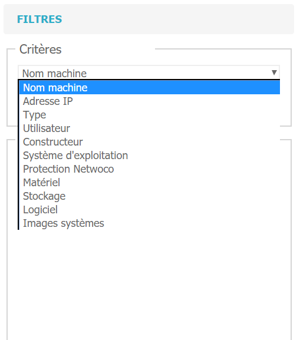
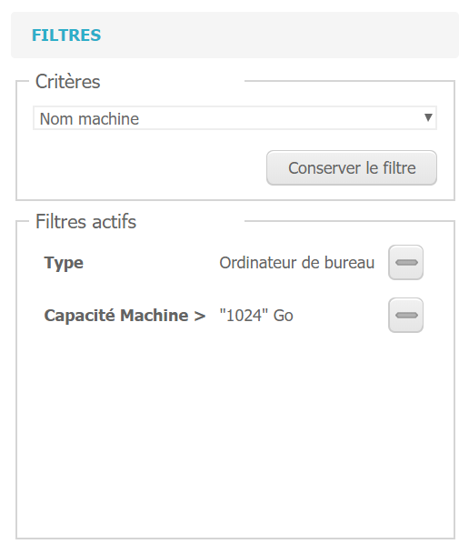

# Utilisation gestion de parc

 La gestion de parc s'effectue dans l'onglet "Gestion de parc".

L'écran affiche les informations détaillées sur tout le parc informatique associé à une licence.

En sélectionnant un poste dans la liste, il est possible de voir l'ensemble de ses 

* composants \(processeur, carte mère, carte graphique...\)

* logiciels installés

* des informations sur les disques et partitions

Des filtres de recherche sont disponibles afin de limiter l'affichage des informations. Ils peuvent être très utiles notamment pour les parcs de taille importante.

Exemple de filtres : Afficher uniquement les postes fixes de plus d'1To de capacité.

