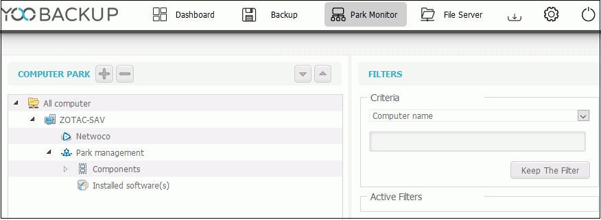
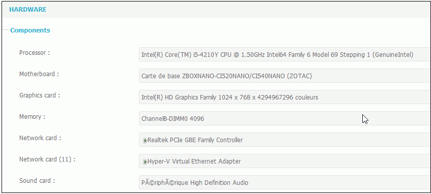
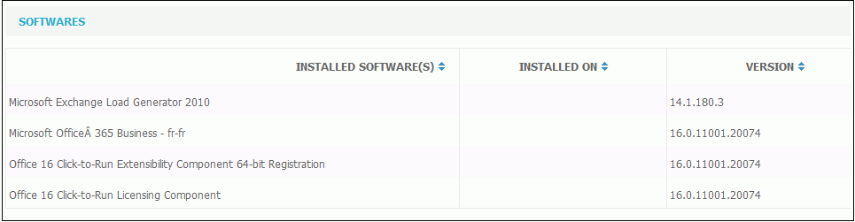
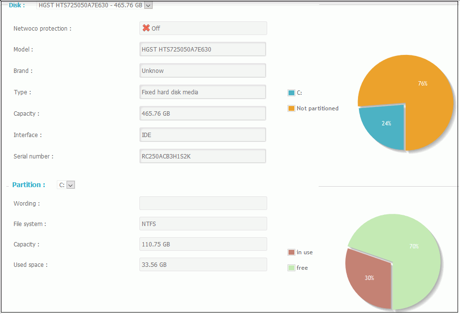
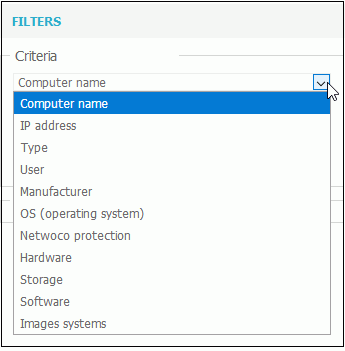
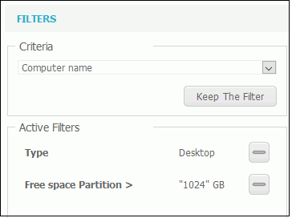

# Use of Park Management

The park management is done in the "Park Monitor" tab.

The screen displays detailed about the entire computer park associated with the license.

Select a computer in the list to see its: 

* components \(processor, motherboard, graphic card...\)

* software installed

* information on disks and partitions

Search filters are available to narrow information displayed. They can be very usefull especially for large park. 

Example of filters: Displays only desktops with a capacity over 1Tb. 

