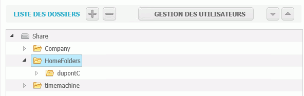
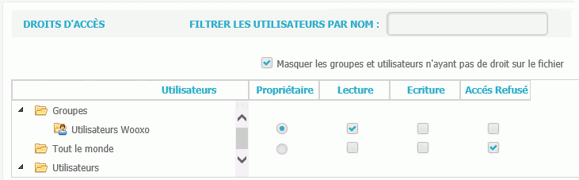
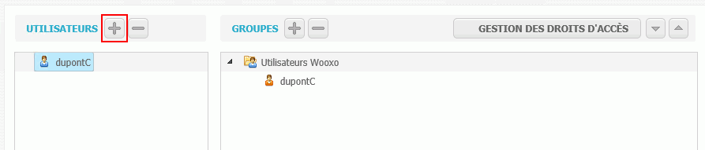
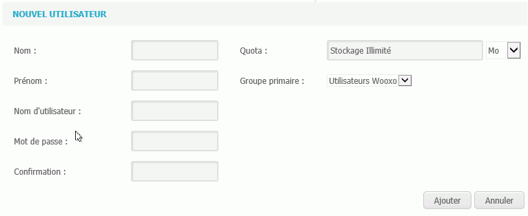

# Utilisation serveur de fichiers  \(WIP\)

 L'utilisation du serveur de fichiers s'effectue dans l'onglet "Serveur de fichiers".

Le serveur de fichiers permet de gérer l'ajout et la suppression de dossiers/répertoires/fichiers et d'attribuer/supprimer des droits d'accès sur ces éléments à certains utilisateurs ou groupes d'utilisateurs.

La première partie de l'écran affiche la liste des dossiers. En utilisant les icônes "+" et "-" il est possible d'ajouter ou de supprimer un élément.

La deuxième partie de l'écran est dédiée à la gestion des droits d'accès.  
Le droit propriétaire peut supprimer le répertoire.

Il est possible d'ajouter un  nouvel utilisateur et de lui attribuer des droits d'accès. 

#### _Pour ajouter un utilisateur_ 

1. Cliquer sur Gestion des utilisateurs
2. Cliquer sur le "+" dans la partie Utilisateur  

   

3. Saisissez les informations de connexion   Le groupe primaire correspond au groupe auquel appartient l'utilisateur. Le quotas correspond à la capacité de stockage. 
4. Cliquez sur Ajouter.
5. Une fois l'utilisateur créé, sélectionnez le et cliquez sur Droits d'accès pour lui attribuer ses droits \(en lecture, écriture\). 

  

