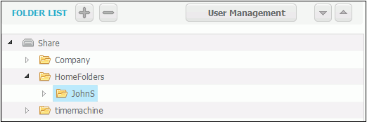
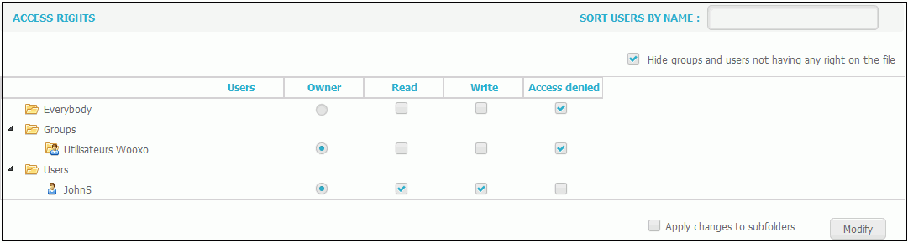
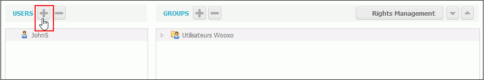
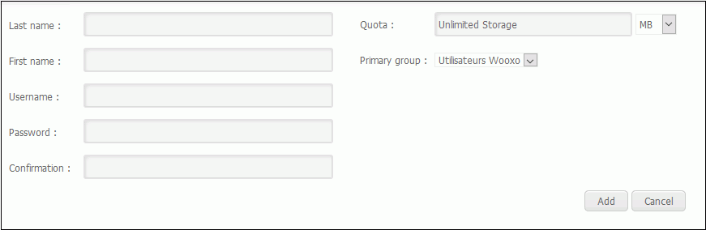

# Use of File Servers

The use of file servers is done in the "File Server" tab.

The file server is used to manage addition or deletion of folders/directories/files and to assignor remove access rights on these items to some users or groups of users.

The first part of the screen lists the folders. Use the "+" and "-" icon to add or delete item\(s\). 

The second part of the screen is dedicated to the access rights management.  
The owner right can delete the directory.

It is possible to add a new user and assign him access rights.

#### _To add a user_

1. Click on User Management
2. Click the "+" in the Users area  
3. Enter the login information  
4. The primary group corresponds to the group to which the user belongs. The quotas corresponds to the storage capacity. 
5. Click Add.
6. Select the user just created and click on Righ Management to give him access rights \(read, write...\). 

  

